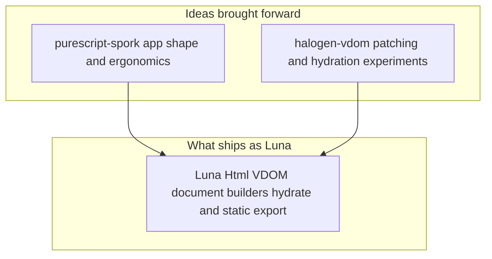

Building this site took longer than expected, not because of missing tools, but because every layer kept inviting one more rewrite. Visual ideas kept changing, content kept growing, and architecture decisions kept moving from quick shortcuts into systems that had to last. At some point, the project stopped being just a personal blog and became a small platform with strong constraints around static delivery, type safety, performance, and maintainability. Halfway through I realized the UI layer itself had to be mine, not borrowed wholesale from something that could not move with current PureScript. That is where Luna shows up. This writeup tells the full story in technical detail: markdown to manifest, static export, hydration, routing, WebGL, and the transitions layer on top.

## Table of Contents

[1. Luna: a client library I wrote for this stack](#luna-a-client-library-i-wrote-for-this-stack)  
[2. Stack and System Shape](#stack-and-system-shape)  
[3. Content Pipeline from Markdown to Manifest](#content-pipeline-from-markdown-to-manifest)  
[4. Build and Delivery Pipeline](#build-and-delivery-pipeline)  
[5. Routing Model and URL Contract](#routing-model-and-url-contract)  
[6. Static Site Generation Process](#static-site-generation-process)  
[7. Luna Rendering and Hydration in this repo](#luna-rendering-and-hydration-in-this-repo)  
[8. WebGL Logo Architecture](#webgl-logo-architecture)  
[9. Client Side Navigation and View Transitions](#client-side-navigation-and-view-transitions)  
[10. Table of Contents Engine and Active Section Story](#table-of-contents-engine-and-active-section-story)  
[11. Current Tradeoffs and Next Steps](#current-tradeoffs-and-next-steps)

## Luna: a client library I wrote for this stack

In the first serious article about this site I want to be blunt about one thing before anything else. I wrote my own client side library and named it Luna. It is not a framework marketing exercise. It came from frustration with two existing pieces of the PureScript ecosystem that I actually liked, but could not ship on long term.

purescript-spork was the mental model I wanted. Small surface, clear update loop, easy to hold in your head. Spork is also effectively stuck in an older era. It targets an older PureScript story, it still leans on Bower era packaging, and moving it forward to the toolchain I use every day would have meant maintaining a fork of a fork just to keep dependencies honest. I did not want my blog to depend on that kind of glue.

Halogen’s VDOM layer is excellent, and there is work around a hydration oriented fork of halogen-vdom that gets partway toward attaching to server rendered trees. That path still hit walls for what I cared about: predictable static export, a clean story for prerendered HTML as the source of truth, and hydration behavior that does not surprise you on edge cases. I kept running into limitations that are nobody’s fault, they are just the cost of general purpose machinery that was not built exactly for my narrow static site plus hydrate workflow.

So Luna is mostly a fusion of ideas from Spork’s app shape and Halogen VDOM machinery, with a hydration path stitched in and adjusted until static HTML from `renderDocument` could load in the browser and attach without throwing away the first paint. Prerender uses Luna’s HTML builders on the Node side. The client bundle hydrates the same conceptual tree. Same types, same render function family, one story end to end.

What Luna gives me today is a single place to do both jobs. Static export for SSG. Client runtime for SPA style navigation after load. The honest part is hydration is still not quite good. Some cases are brittle. Some attributes and event wiring need more hardening. I am shipping anyway because the site works, first paint is real HTML, and incremental fixes are easier inside a library I control than inside three upstreams I do not.

Rough lineage in one picture:



If you only read one technical paragraph in this whole post, read this one. Luna exists so I can stay on modern PureScript with Spago, keep a Spork like programming feel, and still hydrate prerendered pages without pretending the ecosystem already shipped a perfect drop in for that exact combo. Everything below is how this particular site uses that bet.

## Stack and System Shape

I kept this stack intentionally boring in the right places and custom in the places that mattered to me. PureScript and Luna own rendering and state transitions. Markdown stays the authoring format because I want content to remain portable and easy to edit. Tailwind handles visual language. Node scripts plus Spago commands glue everything into one repeatable build.

I split architecture into two phases on purpose. Build phase outputs full static pages. Browser phase hydrates those pages and takes over navigation. That boundary made the project easier to maintain because I could debug content and layout as static output first, then layer interactivity without changing the publishing model.

Folder layout follows that decision. Source markdown lives in `content/`. Normalized generated content lives in `generated/posts.json`. Prerendered HTML lands in `dist/**/index.html`. Client runtime ships as `dist/app.js`. Browser starts from real HTML and Luna attaches to `#app` instead of repainting everything from scratch.

## Content Pipeline from Markdown to Manifest

I wanted content ingestion to be deterministic, so I pushed everything through one build entry point: `BuildContentMain`. It walks `content/` recursively, parses frontmatter and markdown body, renders HTML, computes normalized fields, and groups entries by section. Result is still one manifest file at `generated/posts.json`, but the active pipeline is now PureScript-first instead of a custom JS content script.

Single manifest became the contract between two worlds. Prerender needs typed input to build every route. Hydration needs the same data shape to avoid runtime drift. Using one artifact for both removed a lot of subtle mismatch bugs.

`src/Types.purs` is where I lock that contract. `SiteManifest`, `Post`, and `Thought` are not passive definitions. They are the guardrails that keep content and templates aligned while the project evolves.

```purescript
type SiteManifest =
  { posts :: Array Post
  , thoughts :: Array Thought
  , tags :: Array String
  }
```

This explicit schema is one of the most useful parts of the stack because it removes many categories of runtime mismatch between content and templates. The interesting detail now is that discovery, frontmatter parsing, markdown rendering, heading-id generation, TOC extraction, and date normalization all happen inside the PureScript content pipeline.

## Build and Delivery Pipeline

I kept the build strict and linear so each step has one job. Content generation runs first because everything else depends on the manifest. PureScript compile runs next so type errors fail early. Prerender writes static HTML after that. Browser bundle follows. CSS and assets are the final stage.

```bash
pnpm run content
pnpm run spago:build
pnpm run prerender
pnpm run bundle:prod
pnpm run css
pnpm run copy:assets
```

Keeping prerender and browser bundle separate was one of the best decisions in this repo. Static pages give fast first paint and simple hosting. Client bundle adds route updates, interactivity, and animation. That separation made debugging routing migration much less chaotic.

## Routing Model and URL Contract

I started routing from one algebraic type and forced everything through it. Every path maps to `Route`, then `routing-duplex` handles encode and decode. That keeps URL printing and parsing in sync and avoids drift between server output and browser behavior.

```purescript
data Route
  = Home
  | About
  | SectionIndex String
  | SectionPost String String
```

Path printing appends trailing slashes to stay consistent with generated folder based output. Parsing normalizes incoming paths so both `/articles/foo` and `/articles/foo/` resolve to the same route value. The important change from the earlier version is that URLs now mirror content sections directly: `/articles/{slug}/`, `/projects/{slug}/`, and `/til/{slug}/`, with section indexes at `/articles/`, `/projects/`, and `/til/`. The old `collection/*` path family is gone because it drifted away from the actual content model.

## Static Site Generation Process

`PrerenderMain` is where I turn content into deployable pages. It reads the manifest, computes all routes, resolves output paths, and writes complete HTML documents.

I use Luna document builders to keep this typed end to end. Each page gets title, charset, stylesheet, root app HTML, deferred client script, and inline serialized model. That part changed recently in an important way: the inline model is now sliced for most pages so the browser does not receive every `bodyHtml` string up front. Full content still exists in `dist/site-manifest.json`, and the client loads that lazily when it needs a full post body during navigation.

```purescript
renderPage title outputFile manifest route =
  renderDocument $
    emptyDocument
      # withTitle title
      # withCharset "UTF-8"
      # withStylesheet stylesheetHref
      # withBodyHtml bodyHtml
      # withInlineScript (serializeModelScript (toJsonString (encodeJson slicedManifest)))
      # withScriptDefer scriptSrc
```

I chose `index.html` per route directory because it keeps URLs clean and static hosting straightforward. Home maps to root `index.html`. Nested routes map to folder indexes. Route printing and browser history stay consistent with generated files.

This also gives a real no-JS first paint. Content is already in HTML. Hydration then upgrades behavior without taking away what the reader already sees.

## Luna Rendering and Hydration in this repo

This is where Luna pays off for me in day to day work. I use the same rendering model for prerender output and browser hydration. In `App.purs`, route and manifest live in one `Model`, and state changes pass through one update loop.

I moved to this shape because I did not want route logic spread across random DOM handlers. Route transitions now pass through typed actions in `update`, which makes behavior easier to reason about and easier to debug.

```purescript
type Model =
  { route :: Route
  , manifest :: SiteManifest
  , activeTocId :: Maybe String
  }

data Action
  = RouteChanged (Maybe Route)
  | NavigatePath String
  | ReplaceManifest SiteManifest
```

`Main.purs` boots runtime in a sequence I can read at a glance. It finds `#app`, deserializes the sliced manifest from `window.__LUNA_INITIAL_MODEL__`, derives initial route from `window.location.pathname`, creates initial model, hydrates Luna, wires route inputs, mounts the WebGL logo, and runs the app. When navigation targets a post route and the browser only has sliced data, the app fetches `site-manifest.json` once, replaces manifest state, and then continues the route transition.

Hydration call is:

```purescript
inst <- LunaApp.makeHydrate (never `merge` never) (SiteApp.app initialModel) appRootNode
```

That line matters because Luna attaches to prerendered DOM instead of replacing it. When hydration goes wrong on edge cases, I can debug machine and prop hydration paths directly instead of chasing ad hoc DOM replacements.

Route input wiring was extracted into `RouteInput.purs` so `Main` stays small. `setupRouteInputs` subscribes to decoded browser route changes and internal link navigation input in one place, then feeds those events into Luna actions.

## WebGL Logo Architecture

I started the logo as a visual accent and it turned into a small rendering subsystem. Geometry, matrices, shader source, and animation state live in PureScript. Low level WebGL calls stay in JS FFI where browser APIs are simpler to use directly.

Responsibility split is deliberate. PureScript owns shader strings, typed geometry arrays, animation updates, perspective math, and composition logic. FFI owns context setup, shader compile and link, buffer uploads, uniform and attribute binding, and draw calls. Luna stays outside GL internals and only renders the shell around the canvas. That isolation kept experiments safe.

Several refinements were added after profiling and visual testing. Static GL configuration was moved out of per frame draw path. Constant uniforms were moved to one time setup. Repeated matrix buffer allocation in hot path was replaced with a reusable typed array. Fragment shader Bayer threshold logic was rewritten to avoid a long branch chain.

Canvas creation now happens in PureScript and WebGL initialization receives the canvas element directly. That reduced DOM lookup overhead and kept ownership of DOM lifecycle on the typed side.

Logo remains clickable because container is an anchor and canvas sets `pointer-events:none`. Animation still renders as usual, but click goes to the link target.

Core hot path now looks like this conceptually. Update state in PureScript. Compute model view matrix. Pass matrix to `logoDraw`. Reuse buffer. Draw.

## Client Side Navigation and View Transitions

My target here was simple: keep static delivery, but make navigation feel like an app after first load. Internal links are intercepted, history updates through `pushState`, actions enter Luna update cycle, and VDOM patches only the parts that changed.

This input flow is centralized in:

```purescript
setupRouteInputs
  :: forall route
   . Node
  -> Routing.RouteCodec route
  -> Routing.RoutingMode
  -> (Maybe route -> Effect Unit)
  -> (String -> Effect Unit)
  -> Effect (Effect Unit)
```

`LinkInterceptor.js` follows progressive enhancement. It checks for `document.startViewTransition` and reduced motion preference. If supported, route update runs inside transition callback. If not, update runs immediately with the same behavior.

I also kept a tiny active-link color transition in the rail. It is a small detail, but combined with view transitions it makes route changes feel calmer.

## Table of Contents Engine and Active Section Story

I built this part after getting annoyed at my own reading flow. Posts kept growing, and scrolling felt like guessing. Left rail links were static, so they were good for site navigation but useless for navigating a single long article. I wanted a rail that understands the document in front of me, not a rail that always says the same thing.

I decided to generate TOC at build time, not at runtime. Reason is simple. Build time extraction is deterministic, easy to test, and gives me one source of truth that both prerender and hydration can share. Now that work lives in the PureScript content pipeline: markdown tokens are scanned in `BuildContent.MdHtml`, headings are normalized, ids are generated, and only the levels I care about are stored. I keep `h2` and `h3`, and I explicitly skip headings like `Table of Contents` so a meta section never appears as a real navigation target in the side rail.

Snippet from the generator:

```purescript
shouldSkipTocHeading :: String -> String -> Boolean
shouldSkipTocHeading title idBase =
  let
    n = String.trim $ String.toLower title
  in
    n == "" || n == "table of contents" || n == "toc" || idBase == "table-of-contents"
```

Core shape in the manifest is intentionally small so it is stable and easy to reason about:

```purescript
type TocItem =
  { id :: String
  , title :: String
  , level :: Int
  }

type Post =
  { slug :: String
  , title :: String
  , bodyHtml :: String
  , toc :: Array TocItem
  -- other fields omitted
  }
```

At render time, `App.purs` picks TOC from the current route and passes it to `leftRail`. I wanted active state to stay in Luna model, not in manual class mutation scripts. So `activeTocId` lives in the model, and rail links derive styles from that value. Indentation comes from `level`, and active styles come from one state field.

This is the core render path where route state and active id become UI:

```purescript
render :: Model -> Html Action
render model =
  siteLayout
    model.route
    (currentToc model.manifest model.route)
    model.activeTocId
    (Just SetActiveToc)
    (renderPage model.manifest model.route)
```

Hydration is where I paid the tax for getting this wrong once. Earlier version initialized `activeTocId` too early. Server HTML still had neutral TOC classes, client expected active classes, and Luna rightly rejected hydration due to mismatch. Fix was to start with `activeTocId: Nothing`, match prerendered DOM first, then update state after runtime is alive.

This was the practical hydration guardrail:

```purescript
let
  initialModel =
    { route: initialRoute
    , manifest
    , activeTocId: Nothing
    }
inst <- LunaApp.makeHydrate (never `merge` never) (SiteApp.app initialModel) appRootNode
```

Scroll sync looked easy and still tripped me up. Reading geometry on raw input events can happen before layout settles, so active state can lag or get stuck. What finally worked was tying scrollspy to the actual scroll container and computing active heading inside `requestAnimationFrame`. That timing gives stable geometry and keeps the update loop predictable.

`TocActive.js` now does the timing work in one place:

```javascript
export function setupScrollSpyImpl(containerId, callback) {
  var el = document.getElementById(containerId);
  if (!el) return;

  var rafId = 0;
  el.addEventListener("scroll", function () {
    if (rafId) cancelAnimationFrame(rafId);
    rafId = requestAnimationFrame(function () {
      rafId = 0;
      callback(computeActiveTocId())();
    });
  }, { passive: true });
}
```

Full flow in one ASCII diagram:

```text
content/*.md
   |
   | BuildContentMain
   v
generated/posts.json  ---->  SiteManifest (typed in PureScript)
   |                                |
   | prerender                      | hydrate
   v                                v
dist/**/index.html            Main.purs initialModel
   |                                |
   | includes toc links             | activeTocId starts as Nothing
   v                                v
Left rail static HTML  <----  Luna makeHydrate attaches safely
                                    |
                                    | on post navigation if bodyHtml is sliced
                                    v
                           fetch /site-manifest.json once
                                    |
                                    v
                           ReplaceManifest -> continue route transition
                                    |
                                    | user scrolls #content-scroll
                                    v
                           TocActive.setupScrollSpy (rAF)
                                    |
                                    v
                           detect heading id from geometry
                                    |
                                    v
                           SetActiveToc -> Luna update
                                    |
                                    v
                           Left rail rerender with active classes
```

After this, everything lines up in a way I trust. Client navigation swaps route state, rail receives the new TOC, scroll updates `activeTocId`, and active section follows the reader without hacks. On paper this is a small UI feature. In practice it became one of the best examples of why I built Luna and this pipeline in the first place. I can follow data from markdown file all the way to interactive state, and when it breaks, I can fix it in my own architecture instead of guessing inside a black box.

## Current Tradeoffs and Next Steps

Current architecture favors clarity. Manifest schema is explicit and typed. Route logic is centralized. Static output remains primary delivery mode. Hydration upgrades interaction without requiring a server rendering runtime.

The biggest open work is still Luna itself, not this repo’s content. Hydration needs to get genuinely boring: fewer edge cases, clearer guarantees around event props, and tighter alignment between string rendered HTML and what the client machine expects to attach to. Static export already feels solid. Client navigation after load feels solid. The gap is polish on the handoff between those two worlds.

Most useful product level work is already visible from current constraints. The manifest is already partially split in practice by using sliced inline hydration plus a lazily loaded full `site-manifest.json`, but larger archives may still want finer-grained content fetches later. Search can move from lightweight island to indexed lookup. Code block highlighting can be applied at content generation stage. Theme system can be layered without changing route model. Each of those can land without abandoning Luna because the boundaries are already drawn.

Version in production today feels stable because each part has one job and one clear boundary. Content pipeline transforms text. Prerender builds pages. Luna hydrates state and owns VDOM. Routing updates model. Patches hit the tree instead of replacing the document. WebGL logo stays isolated and fast. This made the project finally feel finished enough to publish, while Luna still has room to grow into the library I wish had existed when I started.
