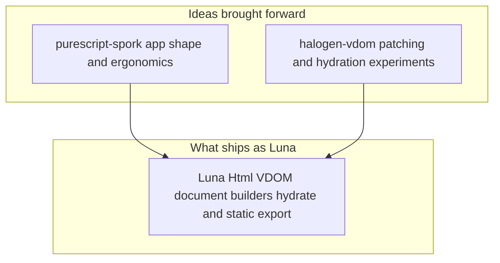

Building this site took longer than expected, not because of missing tools, but because every layer kept inviting one more rewrite. Visual ideas kept changing, content kept growing, and architecture decisions kept moving from quick shortcuts into systems that had to last. At some point, the project stopped being just a personal blog and became a small platform with strong constraints around static delivery, type safety, performance, and maintainability. Halfway through I realized the UI layer itself had to be mine, not borrowed wholesale from something that could not move with current PureScript. That is where Luna shows up. This writeup tells the full story in technical detail: markdown to manifest, static export, hydration, routing, WebGL, and the transitions layer on top.

## Table of Contents

[1. Luna: a client library I wrote for this stack](#luna-a-client-library-i-wrote-for-this-stack)  
[2. Stack and System Shape](#stack-and-system-shape)  
[3. Content Pipeline from Markdown to Manifest](#content-pipeline-from-markdown-to-manifest)  
[4. Build and Delivery Pipeline](#build-and-delivery-pipeline)  
[5. Routing Model and URL Contract](#routing-model-and-url-contract)  
[6. Static Site Generation Process](#static-site-generation-process)  
[7. Luna Rendering and Hydration in this repo](#luna-rendering-and-hydration-in-this-repo)  
[8. WebGL Logo Architecture](#webgl-logo-architecture)  
[9. Client Side Navigation and View Transitions](#client-side-navigation-and-view-transitions)  
[10. Table of Contents Engine and Active Section Story](#table-of-contents-engine-and-active-section-story)  
[11. Current Tradeoffs and Next Steps](#current-tradeoffs-and-next-steps)

## Luna: a client library I wrote for this stack

In the first serious article about this site I want to be blunt about one thing before anything else. I wrote my own client side library and named it Luna. It is not a framework marketing exercise. It came from frustration with two existing pieces of the PureScript ecosystem that I actually liked, but could not ship on long term.

purescript-spork was the mental model I wanted. Small surface, clear update loop, easy to hold in your head. Spork is also effectively stuck in an older era. It targets an older PureScript story, it still leans on Bower era packaging, and moving it forward to the toolchain I use every day would have meant maintaining a fork of a fork just to keep dependencies honest. I did not want my blog to depend on that kind of glue.

Halogen's VDOM layer is excellent, and there is work around a hydration oriented fork of halogen-vdom that gets partway toward attaching to server rendered trees. That path still hit walls for what I cared about: predictable static export, a clean story for prerendered HTML as the source of truth, and hydration behavior that does not surprise you on edge cases. I kept running into limitations that are nobody's fault, they are just the cost of general purpose machinery that was not built exactly for my narrow static site plus hydrate workflow.

So Luna is mostly a fusion of ideas from Spork's app shape and Halogen VDOM machinery, with a hydration path stitched in and adjusted until static HTML from `renderDocument` could load in the browser and attach without throwing away the first paint. Prerender uses Luna's HTML builders on the Node side. The client bundle hydrates the same conceptual tree. Same types, same render function family, one story end to end.

What Luna gives me today is a single place to do both jobs. Static export for SSG. Client runtime for SPA style navigation after load. The honest part is hydration is still not quite good. Some cases are brittle. Some attributes and event wiring need more hardening. I am shipping anyway because the site works, first paint is real HTML, and incremental fixes are easier inside a library I control than inside three upstreams I do not.

Rough lineage in one picture:



If you only read one technical paragraph in this whole post, read this one. Luna exists so I can stay on modern PureScript with Spago, keep a Spork like programming feel, and still hydrate prerendered pages without pretending the ecosystem already shipped a perfect drop in for that exact combo. Everything below is how this particular site uses that bet.

## Stack and System Shape

I kept this stack intentionally boring in the right places and custom in the places that mattered to me. PureScript and Luna own rendering and state transitions. Markdown stays the authoring format because I want content to remain portable and easy to edit. Tailwind handles visual language. Node scripts plus Spago commands glue everything into one repeatable build.

I split architecture into two phases on purpose. Build phase outputs full static pages. Browser phase hydrates those pages and takes over navigation. That boundary made the project easier to maintain because I could debug content and layout as static output first, then layer interactivity without changing the publishing model.

Folder layout follows that decision. Source markdown lives in `content/`. Normalized generated content lives in `generated/posts.json`. Prerendered HTML lands in `dist/**/index.html`. Client runtime ships as `dist/app.js`. Browser starts from real HTML and Luna attaches to `#app` instead of repainting everything from scratch.

## Content Pipeline from Markdown to Manifest

I wanted content ingestion to be deterministic, so I pushed everything through one build entry point: `BuildContentMain`. It walks `content/` recursively, parses frontmatter and markdown body, renders HTML, computes normalized fields, and groups entries by section. Result is still one manifest file at `generated/posts.json`, but the active pipeline is now PureScript-first instead of a custom JS content script.

Single manifest became the contract between two worlds. Prerender needs typed input to build every route. Hydration needs the same data shape to avoid runtime drift. Using one artifact for both removed a lot of subtle mismatch bugs.

`src/Types.purs` is where I lock that contract. `SiteManifest`, `Post`, and `Thought` are not passive definitions. They are the guardrails that keep content and templates aligned while the project evolves.

```tool-display-card src/Types.purs
type SiteManifest =
  { posts :: Array Post
  , thoughts :: Array Thought
  , tags :: Array String
  }
```

This explicit schema is one of the most useful parts of the stack because it removes many categories of runtime mismatch between content and templates. The interesting detail now is that discovery, frontmatter parsing, markdown rendering, heading-id generation, TOC extraction, and date normalization all happen inside the PureScript content pipeline.

## Build and Delivery Pipeline

I kept the build strict and linear so each step has one job. Content generation runs first because everything else depends on the manifest. PureScript compile runs next so type errors fail early. Prerender writes static HTML after that. Browser bundle follows. CSS and assets are the final stage.

```terminal Build pipeline (local)
pnpm run build
----
> site@0.1.0 build /home/blob/Documents/GitHub/site
> pnpm run content && pnpm run spago:build && pnpm run prerender && pnpm run bundle:prod && pnpm run css && pnpm run copy:assets


> site@0.1.0 content /home/machina/site
> pnpm exec spago run -p site --main BuildContentMain

Reading Spago workspace configuration...

✓ Selecting package to build: site

Downloading dependencies...
Building...
           Src   Lib   All
Warnings     0     0     0
Errors       0     0     0

✓ Build succeeded.

Wrote /home/machina/site/generated/posts.json

> site@0.1.0 spago:build /home/machina/site
> pnpm exec spago build

Reading Spago workspace configuration...

✓ Selecting package to build: site

Downloading dependencies...
Building...
           Src   Lib   All
Warnings     0     0     0
Errors       0     0     0

✓ Build succeeded.


> site@0.1.0 prerender /home/machina/site
> pnpm exec spago run -p site --main PrerenderMain

Reading Spago workspace configuration...

✓ Selecting package to build: site

Downloading dependencies...
Building...
           Src   Lib   All
Warnings     0     0     0
Errors       0     0     0

✓ Build succeeded.

Prerendered site to dist/

> site@0.1.0 bundle:prod /home/machina/site
> mkdir -p dist && pnpm exec purs-backend-es build --int-tags && pnpm exec purs-backend-es bundle-app -m Main -p browser --minify --no-build -t dist/app.js

[  1 of 676] Building Control.Semigroupoid
[  2 of 676] Building Control.Category
[  3 of 676] Building Data.Boolean
[  4 of 676] Building Type.Proxy
[  5 of 676] Building Data.Symbol
[  6 of 676] Building Data.Unit
[  7 of 676] Building Record.Unsafe
[  8 of 676] Building Data.HeytingAlgebra
[  9 of 676] Building Data.Void
[ 10 of 676] Building Data.Eq
[ 11 of 676] Building Data.Semigroup
[ 12 of 676] Building Data.Show
[ 13 of 676] Building Data.Ordering
[ 14 of 676] Building Data.Semiring
[ 15 of 676] Building Data.Ring
[ 16 of 676] Building Data.Ord
[ 17 of 676] Building Data.Function
[ 18 of 676] Building Data.Functor
[ 19 of 676] Building Control.Apply
[ 20 of 676] Building Control.Applicative
[ 21 of 676] Building Control.Bind
[ 22 of 676] Building Control.Monad
[ 23 of 676] Building Data.BooleanAlgebra
[ 24 of 676] Building Data.CommutativeRing
[ 25 of 676] Building Data.EuclideanRing
[ 26 of 676] Building Data.Monoid
[ 27 of 676] Building Data.Bounded
[ 28 of 676] Building Data.DivisionRing
[ 29 of 676] Building Data.Field
[ 30 of 676] Building Data.NaturalTransformation
[ 31 of 676] Building Prelude
[ 32 of 676] Building Effect
[ 33 of 676] Building Effect.Uncurried
[ 34 of 676] Building AnchorNav
[ 35 of 676] Building DOM.HTML.Indexed.AutocompleteType
[ 36 of 676] Building DOM.HTML.Indexed.ButtonType
[ 37 of 676] Building DOM.HTML.Indexed.CrossOriginValue
[ 38 of 676] Building DOM.HTML.Indexed.DirValue
[ 39 of 676] Building DOM.HTML.Indexed.FormMethod
[ 40 of 676] Building DOM.HTML.Indexed.InputType
[ 41 of 676] Building DOM.HTML.Indexed.KindValue
[ 42 of 676] Building DOM.HTML.Indexed.MenuType
[ 43 of 676] Building DOM.HTML.Indexed.MenuitemType
[ 44 of 676] Building DOM.HTML.Indexed.OrderedListType
[ 45 of 676] Building DOM.HTML.Indexed.PreloadValue
[ 46 of 676] Building DOM.HTML.Indexed.ScopeValue
[ 47 of 676] Building DOM.HTML.Indexed.StepValue
[ 48 of 676] Building DOM.HTML.Indexed.WrapValue
[ 49 of 676] Building Data.Monoid.Additive
[ 50 of 676] Building Control.Alt
[ 51 of 676] Building Control.Plus
[ 52 of 676] Building Control.Alternative
[ 53 of 676] Building Control.Extend
[ 54 of 676] Building Control.Comonad
[ 55 of 676] Building Data.Monoid.Conj
[ 56 of 676] Building Data.Monoid.Disj
[ 57 of 676] Building Data.Monoid.Dual
[ 58 of 676] Building Data.Monoid.Endo
[ 59 of 676] Building Data.Monoid.Multiplicative
[ 60 of 676] Building Data.Semigroup.First
[ 61 of 676] Building Data.Semigroup.Last
[ 62 of 676] Building Unsafe.Coerce
[ 63 of 676] Building Safe.Coerce
[ 64 of 676] Building Data.Newtype
[ 65 of 676] Building Data.Monoid.Alternate
[ 66 of 676] Building Data.Functor.Invariant
[ 67 of 676] Building Data.Const
[ 68 of 676] Building Data.Generic.Rep
[ 69 of 676] Building Data.Maybe
[ 70 of 676] Building Data.Either
[ 71 of 676] Building Control.Lazy
[ 72 of 676] Building Data.Tuple
[ 73 of 676] Building Data.Bifunctor
[ 74 of 676] Building Data.Function.Uncurried
[ 75 of 676] Building Data.MediaType
[ 76 of 676] Building Data.Identity
[ 77 of 676] Building Effect.Ref
[ 78 of 676] Building Partial
[ 79 of 676] Building Partial.Unsafe
[ 80 of 676] Building Control.Monad.Rec.Class
[ 81 of 676] Building Control.Monad.ST.Internal
[ 82 of 676] Building Control.Monad.ST
[ 83 of 676] Building Control.MonadPlus
[ 84 of 676] Building Data.Functor.App
[ 85 of 676] Building Data.Functor.Compose
[ 86 of 676] Building Data.Functor.Coproduct
[ 87 of 676] Building Data.Functor.Product
[ 88 of 676] Building Data.Maybe.First
[ 89 of 676] Building Data.Maybe.Last
[ 90 of 676] Building Data.Foldable
[ 91 of 676] Building Data.FunctorWithIndex
[ 92 of 676] Building Data.FoldableWithIndex
[ 93 of 676] Building Data.Ord.Max
[ 94 of 676] Building Data.Ord.Min
[ 95 of 676] Building Data.Semigroup.Foldable
[ 96 of 676] Building Data.Traversable.Accum
[ 97 of 676] Building Data.Traversable.Accum.Internal
[ 98 of 676] Building Data.Traversable
[ 99 of 676] Building Data.Semigroup.Traversable
[100 of 676] Building Data.TraversableWithIndex
[101 of 676] Building Data.Unfoldable1
[102 of 676] Building Data.Array.NonEmpty.Internal
[103 of 676] Building Control.Monad.ST.Uncurried
[104 of 676] Building Data.Array.ST
[105 of 676] Building Control.Monad.ST.Ref
[106 of 676] Building Data.Array.ST.Iterator
[107 of 676] Building Data.Unfoldable
[108 of 676] Building Data.Array
[109 of 676] Building Data.NonEmpty
[110 of 676] Building Data.List.Types
[111 of 676] Building Data.List.Internal
[112 of 676] Building Data.List
[113 of 676] Building Data.Nullable
[114 of 676] Building Foreign.Object.ST
[115 of 676] Building Type.Equality
[116 of 676] Building Type.Data.Boolean
[117 of 676] Building Type.Data.Ordering
[118 of 676] Building Type.Data.Symbol
[119 of 676] Building Type.RowList
[120 of 676] Building Type.Row.Homogeneous
[121 of 676] Building Foreign.Object
[122 of 676] Building Data.Enum
[123 of 676] Building Data.Int.Bits
[124 of 676] Building Data.Number
[125 of 676] Building Data.Int
[126 of 676] Building Data.String.Pattern
[127 of 676] Building Data.String.Unsafe
[128 of 676] Building Data.String.CodeUnits
[129 of 676] Building Data.String.Common
[130 of 676] Building Data.String.CodePoints
[131 of 676] Building Data.String
[132 of 676] Building Effect.Exception
[133 of 676] Building Halogen.VDom.Types
[134 of 676] Building Web.DOM.ChildNode
[135 of 676] Building Web.DOM.Internal.Types
[136 of 676] Building Web.DOM.NonDocumentTypeChildNode
[137 of 676] Building Data.Date.Component
[138 of 676] Building Data.Time.Duration
[139 of 676] Building Data.Date
[140 of 676] Building Data.Time.Component
[141 of 676] Building Data.Time
[142 of 676] Building Data.DateTime
[143 of 676] Building Data.DateTime.Instant
[144 of 676] Building Web.Event.EventPhase
[145 of 676] Building Web.Event.Internal.Types
[146 of 676] Building Web.Event.Event
[147 of 676] Building Web.Event.EventTarget
[148 of 676] Building Web.Internal.FFI
[149 of 676] Building Web.DOM.CharacterData
[150 of 676] Building Web.DOM.Comment
[151 of 676] Building Web.DOM.DOMTokenList
[152 of 676] Building Web.DOM.HTMLCollection
[153 of 676] Building Web.DOM.NodeList
[154 of 676] Building Web.DOM.ParentNode
[155 of 676] Building Web.DOM.ShadowRoot
[156 of 676] Building Web.DOM.Element
[157 of 676] Building Web.DOM.NonElementParentNode
[158 of 676] Building Web.DOM.DocumentFragment
[159 of 676] Building Web.DOM.DocumentType
[160 of 676] Building Web.DOM.ProcessingInstruction
[161 of 676] Building Web.DOM.Text
[162 of 676] Building Web.DOM.Document
[163 of 676] Building Web.DOM.NodeType
[164 of 676] Building Web.DOM.Node
[165 of 676] Building Halogen.VDom.Hydrate
[166 of 676] Building Halogen.VDom.Machine
[167 of 676] Building Halogen.VDom.Util
[168 of 676] Building Halogen.VDom.DOM
[169 of 676] Building Halogen.VDom
[170 of 676] Building Control.Monad.Error.Class
[171 of 676] Building Control.Monad.Cont.Class
[172 of 676] Building Control.Monad.Reader.Class
[173 of 676] Building Control.Monad.ST.Global
[174 of 676] Building Control.Monad.ST.Class
[175 of 676] Building Control.Monad.State.Class
[176 of 676] Building Control.Monad.Trans.Class
[177 of 676] Building Control.Monad.Writer.Class
[178 of 676] Building Effect.Class
[179 of 676] Building Control.Monad.Except.Trans
[180 of 676] Building Control.Monad.Except
[181 of 676] Building Data.List.NonEmpty
[182 of 676] Building Foreign
[183 of 676] Building Halogen.VDom.DOM.Prop
[184 of 676] Building Halogen.VDom.Thunk
[185 of 676] Building Luna.Html.Core
[186 of 676] Building Luna.Html.RenderString
[187 of 676] Building Luna.Html.Document
[188 of 676] Building DOM.HTML.Indexed.InputAcceptType
[189 of 676] Building Web.File.Blob
[190 of 676] Building Web.File.File
[191 of 676] Building Web.File.FileList
[192 of 676] Building Web.HTML.Event.DataTransfer.DataTransferItem
[193 of 676] Building Web.HTML.Event.DataTransfer
[194 of 676] Building Web.Clipboard.ClipboardEvent
[195 of 676] Building Web.HTML.Event.DragEvent
[196 of 676] Building Web.HTML.Common
[197 of 676] Building Web.DOM
[198 of 676] Building Web.HTML.HTMLElement
[199 of 676] Building Web.HTML.HTMLHyperlinkElementUtils
[200 of 676] Building Web.HTML.HTMLAnchorElement
[201 of 676] Building Web.HTML.HTMLAreaElement
[202 of 676] Building Data.JSDate
[203 of 676] Building Web.HTML.HTMLMediaElement.CanPlayType
[204 of 676] Building Web.HTML.HTMLMediaElement.NetworkState
[205 of 676] Building Web.HTML.HTMLMediaElement.ReadyState
[206 of 676] Building Web.HTML.HTMLMediaElement
[207 of 676] Building Web.HTML.HTMLAudioElement
[208 of 676] Building Web.HTML.HTMLBRElement
[209 of 676] Building Web.HTML.HTMLBaseElement
[210 of 676] Building Web.HTML.HTMLBodyElement
[211 of 676] Building Web.HTML.HTMLFormElement
[212 of 676] Building Web.HTML.ValidityState
[213 of 676] Building Web.HTML.HTMLButtonElement
[214 of 676] Building Web.HTML.HTMLCanvasElement
[215 of 676] Building Web.HTML.HTMLDListElement
[216 of 676] Building Web.HTML.HTMLDataElement
[217 of 676] Building Web.HTML.HTMLDataListElement
[218 of 676] Building Web.HTML.HTMLDivElement
[219 of 676] Building Web.HTML.HTMLDocument.ReadyState
[220 of 676] Building Web.HTML.HTMLDocument.VisibilityState
[221 of 676] Building Web.HTML.HTMLHtmlElement
[222 of 676] Building Web.HTML.HTMLScriptElement
[223 of 676] Building Web.HTML.HTMLDocument
[224 of 676] Building Web.HTML.HTMLEmbedElement
[225 of 676] Building Web.HTML.HTMLFieldSetElement
[226 of 676] Building Web.HTML.HTMLHRElement
[227 of 676] Building Web.HTML.HTMLHeadElement
[228 of 676] Building Web.HTML.HTMLHeadingElement
[229 of 676] Building Web.HTML.History
[230 of 676] Building Web.HTML.Location
[231 of 676] Building Web.HTML.Navigator
[232 of 676] Building Web.Storage.Storage
[233 of 676] Building Web.HTML.Window
[234 of 676] Building Web.HTML.HTMLIFrameElement
[235 of 676] Building Web.HTML.HTMLImageElement.CORSMode
[236 of 676] Building Web.HTML.HTMLImageElement.DecodingHint
[237 of 676] Building Web.HTML.HTMLImageElement.Laziness
[238 of 676] Building Web.HTML.HTMLImageElement
[239 of 676] Building Web.HTML.SelectionMode
[240 of 676] Building Web.HTML.HTMLInputElement
[241 of 676] Building Web.HTML.HTMLKeygenElement
[242 of 676] Building Web.HTML.HTMLLIElement
[243 of 676] Building Web.HTML.HTMLLabelElement
[244 of 676] Building Web.HTML.HTMLLegendElement
[245 of 676] Building Web.HTML.HTMLLinkElement
[246 of 676] Building Web.HTML.HTMLMapElement
[247 of 676] Building Web.HTML.HTMLMetaElement
[248 of 676] Building Web.HTML.HTMLMeterElement
[249 of 676] Building Web.HTML.HTMLModElement
[250 of 676] Building Web.HTML.HTMLOListElement
[251 of 676] Building Web.HTML.HTMLObjectElement
[252 of 676] Building Web.HTML.HTMLOptGroupElement
[253 of 676] Building Web.HTML.HTMLOptionElement
[254 of 676] Building Web.HTML.HTMLOutputElement
[255 of 676] Building Web.HTML.HTMLParagraphElement
[256 of 676] Building Web.HTML.HTMLParamElement
[257 of 676] Building Web.HTML.HTMLPreElement
[258 of 676] Building Web.HTML.HTMLProgressElement
[259 of 676] Building Web.HTML.HTMLQuoteElement
[260 of 676] Building Web.HTML.HTMLSelectElement
[261 of 676] Building Web.HTML.HTMLSourceElement
[262 of 676] Building Web.HTML.HTMLSpanElement
[263 of 676] Building Web.HTML.HTMLStyleElement
[264 of 676] Building Web.HTML.HTMLTableCaptionElement
[265 of 676] Building Web.HTML.HTMLTableCellElement
[266 of 676] Building Web.HTML.HTMLTableColElement
[267 of 676] Building Web.HTML.HTMLTableDataCellElement
[268 of 676] Building Web.HTML.HTMLTableSectionElement
[269 of 676] Building Web.HTML.HTMLTableElement
[270 of 676] Building Web.HTML.HTMLTableHeaderCellElement
[271 of 676] Building Web.HTML.HTMLTableRowElement
[272 of 676] Building Web.HTML.HTMLTemplateElement
[273 of 676] Building Web.HTML.HTMLTextAreaElement
[274 of 676] Building Web.HTML.HTMLTimeElement
[275 of 676] Building Web.HTML.HTMLTitleElement
[276 of 676] Building Web.HTML.HTMLTrackElement.ReadyState
[277 of 676] Building Web.HTML.HTMLTrackElement
[278 of 676] Building Web.HTML.HTMLUListElement
[279 of 676] Building Web.HTML.HTMLVideoElement
[280 of 676] Building Web.HTML
[281 of 676] Building Web.UIEvent.UIEvent
[282 of 676] Building Web.UIEvent.MouseEvent
[283 of 676] Building Web.PointerEvent.PointerEvent
[284 of 676] Building Web.PointerEvent
[285 of 676] Building Web.TouchEvent.Touch
[286 of 676] Building Web.TouchEvent.TouchList
[287 of 676] Building Web.TouchEvent.TouchEvent
[288 of 676] Building Web.TouchEvent
[289 of 676] Building Web.UIEvent.FocusEvent
[290 of 676] Building Web.UIEvent.KeyboardEvent
[291 of 676] Building Web.UIEvent.WheelEvent
[292 of 676] Building DOM.HTML.Indexed
[293 of 676] Building Luna.Html.Elements
[294 of 676] Building Foreign.Index
[295 of 676] Building Luna.Html.Events
[296 of 676] Building Data.Argonaut.Core
[297 of 676] Building Data.Argonaut.Decode.Error
[298 of 676] Building Data.Array.NonEmpty
[299 of 676] Building Data.Map.Internal
[300 of 676] Building Data.Set
[301 of 676] Building Data.Map
[302 of 676] Building Data.String.NonEmpty.Internal
[303 of 676] Building Data.String.NonEmpty.CodePoints
[304 of 676] Building Data.String.NonEmpty
[305 of 676] Building Data.Argonaut.Decode.Decoders
[306 of 676] Building Record.Unsafe.Union
[307 of 676] Building Record
[308 of 676] Building Data.Argonaut.Decode.Class
[309 of 676] Building Data.Argonaut.Decode.Combinators
[310 of 676] Building Data.Argonaut.Parser
[311 of 676] Building Data.Argonaut.Decode.Parser
[312 of 676] Building Data.Argonaut.Decode
[313 of 676] Building Luna.Html.ModelState
[314 of 676] Building Luna.Html.Properties
[315 of 676] Building Luna.Html.UnsafeHtml
[316 of 676] Building Luna.Html
[317 of 676] Building Components.Footer
[318 of 676] Building Components.Logo.FFI
[319 of 676] Building Components.Logo.Geometry
--- [SKIPPING] 320 of 676 modules ---
[604 of 676] Building JS.Intl.PluralRules
[605 of 676] Building JS.Intl.Segmenter
[606 of 676] Building JS.Intl
[607 of 676] Building JS.LocaleSensitive.Date
[608 of 676] Building JS.LocaleSensitive.Number
[609 of 676] Building JS.LocaleSensitive.String
[610 of 676] Building LinkInterceptor
[611 of 676] Building Luna.Html.Elements.Keyed
[612 of 676] Building RouteInput
[613 of 676] Building TocActive
[614 of 676] Building Main
[615 of 676] Building Node.Buffer.Constants
[616 of 676] Building Node.Buffer.ST
[617 of 676] Building Node.FS.Async
[618 of 676] Building Node.FS.Aff
[619 of 676] Building Node.FS.Stream
[620 of 676] Building Node.Stream.Aff
[621 of 676] Building Pages.Collection
[622 of 676] Building Pages.Project
[623 of 676] Building Prerender.Pages
[624 of 676] Building PrerenderMain
[625 of 676] Building Promise.Rejection
[626 of 676] Building Promise.Internal
[627 of 676] Building Promise
[628 of 676] Building Promise.Lazy
[629 of 676] Building Routing.Match.Error
[630 of 676] Building Routing.Types
[631 of 676] Building Routing.Match
[632 of 676] Building Routing.Parser
[633 of 676] Building Routing
[634 of 676] Building Web.HTML.Event.HashChangeEvent.EventTypes
[635 of 676] Building Routing.Hash
[636 of 676] Building Web.HTML.Event.PopStateEvent.EventTypes
[637 of 676] Building Routing.PushState
[638 of 676] Building Simple.JSON
[639 of 676] Building Spago.Generated.BuildInfo
[640 of 676] Building TocScrollSpy
  Foreign implementation missing.
[641 of 676] Building Type.Function
[642 of 676] Building Type.Row
[643 of 676] Building Type.Prelude
[644 of 676] Building Web.Clipboard.ClipboardEvent.EventTypes
[645 of 676] Building Web.Clipboard
[646 of 676] Building Web.Event.CustomEvent
[647 of 676] Building Web.File.FileReader.ReadyState
[648 of 676] Building Web.File.FileReader
[649 of 676] Building Web.File.Url
[650 of 676] Building Web.HTML.Event.BeforeUnloadEvent.EventTypes
[651 of 676] Building Web.HTML.Event.BeforeUnloadEvent
[652 of 676] Building Web.HTML.Event.DragEvent.EventTypes
[653 of 676] Building Web.HTML.Event.ErrorEvent
[654 of 676] Building Web.HTML.Event.EventTypes
[655 of 676] Building Web.HTML.Event.HashChangeEvent
[656 of 676] Building Web.HTML.Event.PageTransitionEvent.EventTypes
[657 of 676] Building Web.HTML.Event.PageTransitionEvent
[658 of 676] Building Web.HTML.Event.PopStateEvent
[659 of 676] Building Web.HTML.Event.TrackEvent.EventTypes
[660 of 676] Building Web.HTML.Event.TrackEvent
[661 of 676] Building Web.HTML.HTMLDialogElement
[662 of 676] Building Web.PointerEvent.Element
[663 of 676] Building Web.PointerEvent.EventTypes
[664 of 676] Building Web.PointerEvent.Navigator
[665 of 676] Building Web.Storage.Event.StorageEvent
[666 of 676] Building Web.TouchEvent.EventTypes
[667 of 676] Building Web.UIEvent.CompositionEvent.EventTypes
[668 of 676] Building Web.UIEvent.CompositionEvent
[669 of 676] Building Web.UIEvent.EventTypes
[670 of 676] Building Web.UIEvent.FocusEvent.EventTypes
[671 of 676] Building Web.UIEvent.InputEvent.EventTypes
[672 of 676] Building Web.UIEvent.InputEvent.InputType
[673 of 676] Building Web.UIEvent.InputEvent
[674 of 676] Building Web.UIEvent.KeyboardEvent.EventTypes
[675 of 676] Building Web.UIEvent.MouseEvent.EventTypes
[676 of 676] Building Web.UIEvent.WheelEvent.EventTypes

  dist/app.js  78.0kb

⚡ Done in 106ms

> site@0.1.0 css /home/machina/site
> mkdir -p dist/css && BROWSERSLIST_IGNORE_OLD_DATA=1 pnpm exec tailwindcss -c tailwind.config.cjs -i ./css/style.css -o ./dist/css/style.css --minify


Rebuilding...

Done in 1542ms.

> site@0.1.0 copy:assets /home/machina/site
> mkdir -p dist/assets dist/fonts && (cp -r public/assets/* dist/assets/ 2>/dev/null || true) && (cp -r public/fonts/* dist/fonts/ 2>/dev/null || true)
```

Keeping prerender and browser bundle separate was one of the best decisions in this repo. Static pages give fast first paint and simple hosting. Client bundle adds route updates, interactivity, and animation. That separation made debugging routing migration much less chaotic.

## Routing Model and URL Contract

I started routing from one algebraic type and forced everything through it. Every path maps to `Route`, then `routing-duplex` handles encode and decode. That keeps URL printing and parsing in sync and avoids drift between server output and browser behavior.

```tool-display-card src/Types.purs
data Route
  = Home
  | About
  | SectionIndex String
  | SectionPost String String
```

Path printing appends trailing slashes to stay consistent with generated folder based output. Parsing normalizes incoming paths so both `/articles/foo` and `/articles/foo/` resolve to the same route value. The important change from the earlier version is that URLs now mirror content sections directly: `/articles/{slug}/`, `/projects/{slug}/`, and `/til/{slug}/`, with section indexes at `/articles/`, `/projects/`, and `/til/`. The old `collection/*` path family is gone because it drifted away from the actual content model.

## Static Site Generation Process

`PrerenderMain` is where I turn content into deployable pages. It reads the manifest, computes all routes, resolves output paths, and writes complete HTML documents.

I use Luna document builders to keep this typed end to end. Each page gets title, charset, stylesheet, root app HTML, deferred client script, and inline serialized model. That part changed recently in an important way: the inline model carries only what the browser needs to boot and navigate — post metadata, TOC structures, tags, and routing state. It does not carry `bodyHtml` for any post, because post body is already in the page as rendered HTML nodes. There is no reason to serialize it again into JSON.

```tool-display-card src/PrerenderMain.purs
renderPage title outputFile manifest route =
  renderDocument $
    emptyDocument
      # withTitle title
      # withCharset "UTF-8"
      # withMeta "viewport" "width=device-width, initial-scale=1"
      # withStylesheet stylesheetHref
      # withBodyHtml bodyHtml
      # withInlineScript (serializeModelScript (toJsonString (encodeJson slicedManifest)))
      # withScriptDefer scriptSrc
```

`slicedManifest` here means every post has `bodyHtml` stripped before serialization. The rendered HTML is already in the document. Putting the same content into a JSON blob inside a script tag would be pure duplication — same bytes, twice, in the same file, serving no purpose on a direct visit.

I chose `index.html` per route directory because it keeps URLs clean and static hosting straightforward. Home maps to root `index.html`. Nested routes map to folder indexes. Route printing and browser history stay consistent with generated files.

This also gives a real no-JS first paint. Content is already in HTML. Hydration then upgrades behavior without taking away what the reader already sees.

## Luna Rendering and Hydration in this repo

This is where Luna pays off for me in day to day work. I use the same rendering model for prerender output and browser hydration. In `App.purs`, route and manifest live in one `Model`, and state changes pass through one update loop.

I moved to this shape because I did not want route logic spread across random DOM handlers. Route transitions now pass through typed actions in `update`, which makes behavior easier to reason about and easier to debug.

```tool-display-card src/App.purs
type Model =
  { route :: Route
  , manifest :: SiteManifest
  , activeTocId :: Maybe String
  }

data Action
  = RouteChanged (Maybe Route)
  | NavigatePath String
  | ReplaceManifest SiteManifest
```

`Main.purs` boots runtime in a sequence I can read at a glance. It finds `#app`, deserializes the sliced manifest from `window.__LUNA_INITIAL_MODEL__`, derives initial route from `window.location.pathname`, creates initial model, hydrates Luna, wires route inputs, mounts the WebGL logo, and runs the app.

Hydration call is:

```tool-display-card src/Main.purs
inst <- LunaApp.makeHydrate (never `merge` never) (SiteApp.app initialModel) appRootNode
```

That line matters because Luna attaches to prerendered DOM instead of replacing it. When hydration goes wrong on edge cases, I can debug machine and prop hydration paths directly instead of chasing ad hoc DOM replacements.

One thing worth being precise about here: the markdown body content does not need hydration. It is already in the DOM as real HTML nodes painted on first load. Luna does not need to own or reconstruct it. What hydration actually handles is everything around the content — route state, TOC active tracking, event listeners on internal links, left rail interactivity. The body is inert from the framework's perspective on a direct visit, and that is correct. The mistake would be to pull it back through JSON just to have it in the typed model.

Where `bodyHtml` does matter is client-side navigation. When a reader navigates from the home page to a post, the browser never loaded that post's HTML. The body has to arrive somehow. The current approach fetches `/site-manifest.json` lazily at that point and replaces manifest state, which gives Luna the rendered HTML string it needs to patch the DOM. That fetch is the only moment `bodyHtml` has a job to do in the client runtime, and it is a navigation event, not a hydration event.

Route input wiring was extracted into `RouteInput.purs` so `Main` stays small. `setupRouteInputs` subscribes to decoded browser route changes and internal link navigation input in one place, then feeds those events into Luna actions.

## WebGL Logo Architecture

I started the logo as a visual accent and it turned into a small rendering subsystem. Geometry, matrices, shader source, and animation state live in PureScript. Low level WebGL calls stay in JS FFI where browser APIs are simpler to use directly.

Responsibility split is deliberate. PureScript owns shader strings, typed geometry arrays, animation updates, perspective math, and composition logic. FFI owns context setup, shader compile and link, buffer uploads, uniform and attribute binding, and draw calls. Luna stays outside GL internals and only renders the shell around the canvas. That isolation kept experiments safe.

Several refinements were added after profiling and visual testing. Static GL configuration was moved out of per frame draw path. Constant uniforms were moved to one time setup. Repeated matrix buffer allocation in hot path was replaced with a reusable typed array. Fragment shader Bayer threshold logic was rewritten to avoid a long branch chain.

Canvas creation now happens in PureScript and WebGL initialization receives the canvas element directly. That reduced DOM lookup overhead and kept ownership of DOM lifecycle on the typed side.

Logo remains clickable because container is an anchor and canvas sets `pointer-events:none`. Animation still renders as usual, but click goes to the link target.

Core hot path now looks like this conceptually. Update state in PureScript. Compute model view matrix. Pass matrix to `logoDraw`. Reuse buffer. Draw.

## Client Side Navigation and View Transitions

My target here was simple: keep static delivery, but make navigation feel like an app after first load. Internal links are intercepted, history updates through `pushState`, actions enter Luna update cycle, and VDOM patches only the parts that changed.

This input flow is centralized in:

```tool-display-card src/RouteInput.purs
setupRouteInputs
  :: forall route
   . Node
  -> Routing.RouteCodec route
  -> Routing.RoutingMode
  -> (Maybe route -> Effect Unit)
  -> (String -> Effect Unit)
  -> Effect (Effect Unit)
```

`LinkInterceptor.js` follows progressive enhancement. It checks for `document.startViewTransition` and reduced motion preference. If supported, route update runs inside transition callback. If not, update runs immediately with the same behavior.

I also kept a tiny active-link color transition in the rail. It is a small detail, but combined with view transitions it makes route changes feel calmer.

## Table of Contents Engine and Active Section Story

I built this part after getting annoyed at my own reading flow. Posts kept growing, and scrolling felt like guessing. Left rail links were static, so they were good for site navigation but useless for navigating a single long article. I wanted a rail that understands the document in front of me, not a rail that always says the same thing.

I decided to generate TOC at build time, not at runtime. Reason is simple. Build time extraction is deterministic, easy to test, and gives me one source of truth that both prerender and hydration can share. Now that work lives in the PureScript content pipeline: markdown tokens are scanned in `BuildContent.MdHtml`, headings are normalized, ids are generated, and only the levels I care about are stored. I keep `h2` and `h3`, and I explicitly skip headings like `Table of Contents` so a meta section never appears as a real navigation target in the side rail.

Snippet from the generator:

```tool-display-card src/BuildContent/MdHtml.purs
shouldSkipTocHeading :: String -> String -> Boolean
shouldSkipTocHeading title idBase =
  let
    n = String.trim $ String.toLower title
  in
    n == "" || n == "table of contents" || n == "toc" || idBase == "table-of-contents"
```

Core shape in the manifest is intentionally small so it is stable and easy to reason about:

```tool-display-card src/Types.purs
type TocItem =
  { id :: String
  , title :: String
  , level :: Int
  }

type Post =
  { slug :: String
  , title :: String
  , bodyHtml :: String
  , toc :: Array TocItem
  -- other fields omitted
  }
```

At render time, `App.purs` picks TOC from the current route and passes it to `leftRail`. I wanted active state to stay in Luna model, not in manual class mutation scripts. So `activeTocId` lives in the model, and rail links derive styles from that value. Indentation comes from `level`, and active styles come from one state field.

This is the core render path where route state and active id become UI:

```tool-display-card src/App.purs
render :: Model -> Html Action
render model =
  siteLayout
    model.route
    (currentToc model.manifest model.route)
    model.activeTocId
    (Just SetActiveToc)
    (renderPage model.manifest model.route)
```

Hydration is where I paid the tax for getting this wrong once. Earlier version initialized `activeTocId` too early. Server HTML still had neutral TOC classes, client expected active classes, and Luna rightly rejected hydration due to mismatch. Fix was to start with `activeTocId: Nothing`, match prerendered DOM first, then update state after runtime is alive.

This was the practical hydration guardrail:

```tool-display-card src/Main.purs
let
  initialModel =
    { route: initialRoute
    , manifest
    , activeTocId: Nothing
    }
inst <- LunaApp.makeHydrate (never `merge` never) (SiteApp.app initialModel) appRootNode
```

Scroll sync looked easy and still tripped me up. Reading geometry on raw input events can happen before layout settles, so active state can lag or get stuck. What finally worked was tying scrollspy to the actual scroll container and computing active heading inside `requestAnimationFrame`. That timing gives stable geometry and keeps the update loop predictable.

`TocActive.js` now does the timing work in one place:

```tool-display-card src/TocActive.js
export function setupScrollSpyImpl(containerId, callback) {
  var el = document.getElementById(containerId);
  if (!el) return;

  var rafId = 0;
  el.addEventListener("scroll", function () {
    if (rafId) cancelAnimationFrame(rafId);
    rafId = requestAnimationFrame(function () {
      rafId = 0;
      callback(computeActiveTocId())();
    });
  }, { passive: true });
}
```

Full flow in one diagram:

```tool-display-card content-pipeline.txt
content/*.md
   |
   | BuildContentMain
   v
generated/posts.json  ---->  SiteManifest (typed in PureScript)
   |                                |
   | prerender                      | sliced: bodyHtml stripped
   v                                v
dist/**/index.html            window.__LUNA_INITIAL_MODEL__
   |                          (metadata, toc, tags, routing only)
   | body content is                |
   | real HTML nodes                | hydrate
   v                                v
DOM: post body         <----  Luna makeHydrate attaches
(already painted,             does NOT need to own body content
 Luna leaves it alone)              |
                                    | activeTocId starts as Nothing
                                    v
                           hydration matches prerendered DOM safely
                                    |
                                    | on client navigation to a post
                                    v
                           fetch /data/posts/{section}/{slug}.json
                           (body arrives only when needed)
                                    |
                                    v
                           ReplaceManifest -> Luna patches body region
                                    |
                                    | user scrolls #content-scroll
                                    v
                           TocActive.setupScrollSpy (rAF)
                                    |
                                    v
                           detect heading id from geometry
                                    |
                                    v
                           SetActiveToc -> Luna update
                                    |
                                    v
                           Left rail rerender with active classes
```

After this, everything lines up in a way I trust. Client navigation swaps route state, rail receives the new TOC, scroll updates `activeTocId`, and active section follows the reader without hacks. On paper this is a small UI feature. In practice it became one of the best examples of why I built Luna and this pipeline in the first place. I can follow data from markdown file all the way to interactive state, and when it breaks, I can fix it in my own architecture instead of guessing inside a black box.

## Current Tradeoffs and Next Steps

Current architecture favors clarity. Manifest schema is explicit and typed. Route logic is centralized. Static output remains primary delivery mode. Hydration upgrades interaction without requiring a server rendering runtime.

The biggest open work is still Luna itself, not this repo's content. Hydration needs to get genuinely boring: fewer edge cases, clearer guarantees around event props, and tighter alignment between string rendered HTML and what the client machine expects to attach to. Static export already feels solid. Client navigation after load feels solid. The gap is polish on the handoff between those two worlds.

The next concrete improvement on the content side is replacing the whole-manifest lazy fetch with per-post payload files. Right now when any client-side navigation targets a post, the browser fetches all of `site-manifest.json` regardless of which post was requested. The fix is to emit `dist/data/posts/{section}/{slug}.json` during prerender — each containing only that post's `bodyHtml` and `toc` — and fetch only the file for the current route. The inline manifest stays slim for navigation and listing. Post bodies arrive on demand, scoped to what the reader actually opened, and each file is independently cacheable at the CDN level.

`bodyHtml` in the typed model exists for one reason: client-side navigation between posts, where the browser has never loaded the destination page's HTML. On a direct visit the body is already in the DOM and the model field is empty by design. That distinction matters for understanding what the lazy fetch is actually solving. It is not a hydration mechanism. It is a content delivery mechanism for the SPA navigation layer on top.

Other work is already visible from current constraints. Search can move from lightweight island to indexed lookup. Code block highlighting can be applied at content generation stage. Theme system can be layered without changing route model. Each of those can land without abandoning Luna because the boundaries are already drawn.

Version in production today feels stable because each part has one job and one clear boundary. Content pipeline transforms text. Prerender builds pages. Luna hydrates state and owns VDOM. Routing updates model. Patches hit the tree instead of replacing the document. WebGL logo stays isolated and fast. This made the project finally feel finished enough to publish, while Luna still has room to grow into the library I wish had existed when I started.